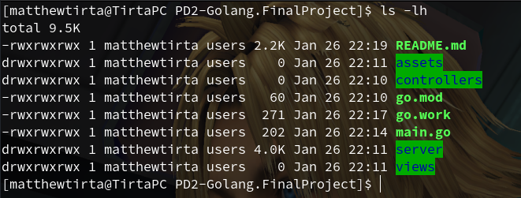
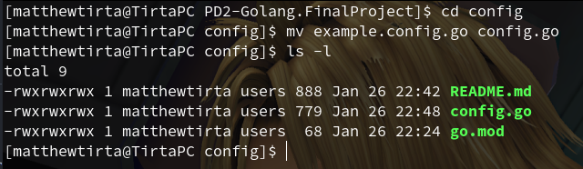
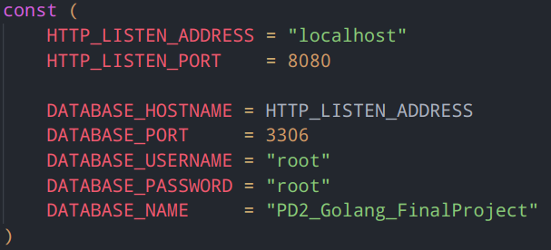
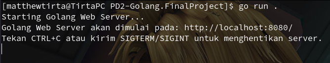

# PD2-Golang.FinalProject
<b>Kelompok 3 - Final Project Pemrograman Dasar 2</b> 
<b>Anggota Kelompok :</b>
<ul>
  <li>Matthew Tirtawidjaja (<a href="https://github.com/TIRTAGT">@TIRTAGT</a>)</li>
  <li>Katon Kurnia Wijaya (<a href="https://github.com/tonkaton">@tonkaton</a>)</li>
</ul>

----

### Cara Instalasi / Penggunaan Program
<ol>
	<li>Clone/Download seluruh repository <a href="https://github.com/TIRTAGT/PD2-Golang.FinalProject">PD2-Golang.FinalProject</a> ke folder yang diinginkan.</li>
	<!-- insert foto contoh cara clone/download disini -->
	 
	 
	<li>Buka folder tersebut di terminal (CMD / PowerShell / Terminal / Git Bash).</li>
		
	 
	 
	<li>Rename file <kbd>example.config.go</kbd> pada folder <kbd>config/</kbd> menjadi <kbd>config.go</kbd></li>
		
	 
	 
	<li>Sesuaikan alamat IP dan/atau port dimulainya HTTP server proyek ini tergantung lingkungan perangkat masing masing</li>
		
	 
	 
	<li>Jalankan program dengan perintah <kbd>go run .</kbd></li>
		
	 
	 
	<li>Kunjungi alamat IP dan port HTTP server yang tertera di terminal pada web browser, atau CTRL+klik (jika lingkungan perangkat mendukung)</li>
	<!-- insert foto tampilan awal web projectnya -->
</ol>

----

### Penjelasan Struktur Folder dan File Project

``assets/``

Folder ini berisi source code untuk frontend (CSS/JS) dan file-file framework frontend yang digunakan (contoh: Bootstrap, JQuery, AdminLTE, dll).

``config/``

Folder ini berisi konfigurasi untuk project ini, seperti konfigurasi database, konfigurasi server, dan lain-lain.

``controllers/``

Folder ini berisi source code untuk web backend project Golang Web Server ini.

``docs/``

Folder ini berisi dokumentasi untuk project ini, seperti dokumentasi API, konten tambahan untuk file README, dan sebagainya.

``server/``

Folder ini berisi source code untuk implementasi Golang Web Server yang dibuat untuk melakukan simulasi teknik MVC (Model-View-Controller) pada Golang.

``views/``

Folder ini berisi source code untuk halaman frontend yang akan diambil dari controller pada rute tersebut (HTML).

``.gitignore``

Sebuah file yang berisi daftar file/folder yang tidak perlu diupload ke git/version control

``go.mod``

Sebuah file yang berfungsi untuk menandakan project ini adalah sebuah module golang

``go.work``

Sebuah file yang berisi lokasi module lokal yang digunakan oleh project ini

``README.md``

File ini

``main.go``

File yang perlu dijalankan dengan golang untuk memulai server

----

### Framework/Tools yang digunakan

<ul>
	<li>Golang (Go) - go1.21.2</li>
</ul>
